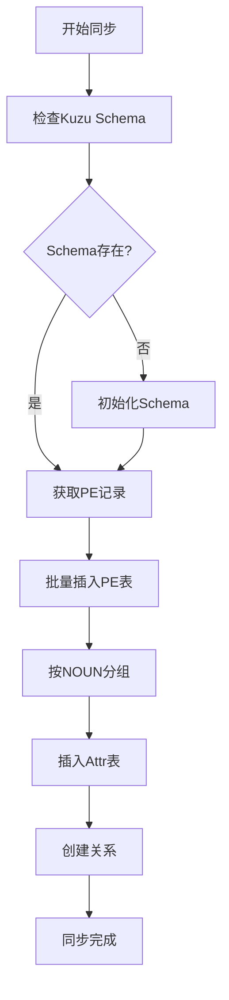
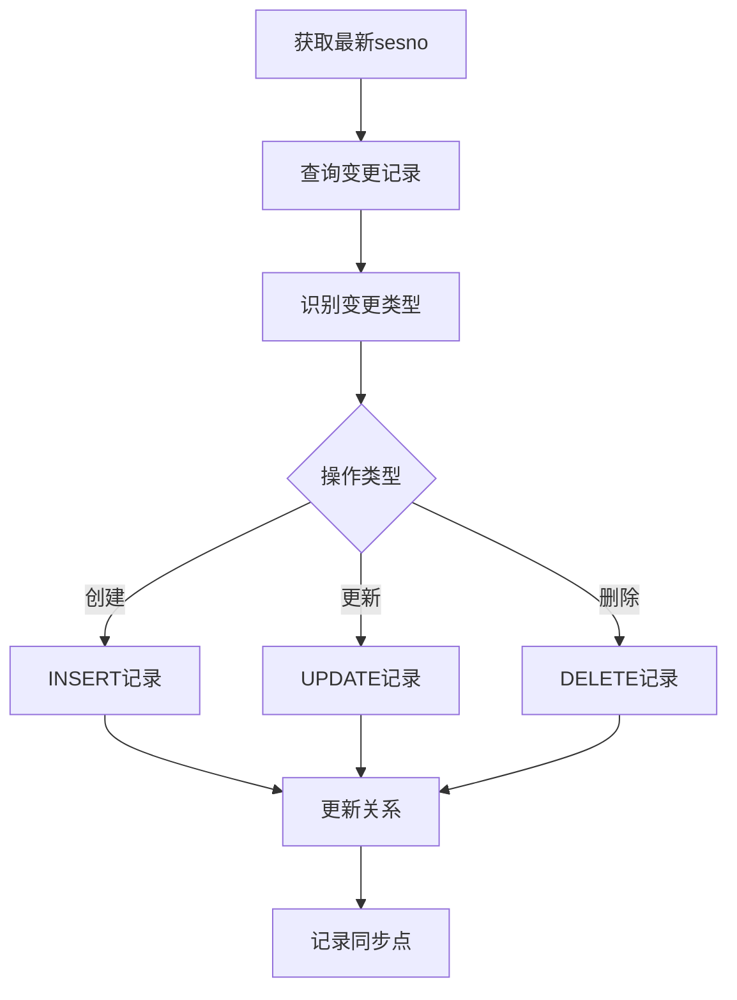

# SurrealDB 到 Kuzu 数据同步方案设计

## 1. 架构概述

### 1.1 数据流向
```
SurrealDB (源) → 数据转换层 → Kuzu (目标)
     ↓               ↓              ↓
  PE + Attrs    类型映射      PE + Attr_<NOUN>
```

### 1.2 核心设计原则
- **强类型映射**：每个 NOUN 对应独立的 `Attr_<NOUN>` 表
- **关系保持**：保留所有层次关系和引用关系
- **增量同步**：支持基于 sesno 的增量更新
- **容错机制**：支持错误跳过和重试
- **并行处理**：支持多线程批量同步

## 2. 数据映射规则

### 2.1 表结构映射

#### SurrealDB 结构
```
pe 表：
- id: string (pe:refno)
- refno: int64
- name: string
- noun: string
- attrs: object (动态属性)
- owner: int64
- sesno: int32
```

#### Kuzu 结构
```
PE 表（主表）：
- refno: INT64 (PRIMARY KEY)
- name: STRING
- noun: STRING
- dbnum: INT32
- sesno: INT32
- deleted: BOOLEAN
- lock: BOOLEAN

Attr_<NOUN> 表（属性表）：
- refno: INT64 (PRIMARY KEY)
- [具体属性字段...]
```

### 2.2 类型映射

| SurrealDB 类型 | Kuzu 类型 | 说明 |
|---------------|-----------|------|
| int/int64 | INT64 | 整数 |
| float/double | DOUBLE | 浮点数 |
| string | STRING | 字符串 |
| bool | BOOLEAN | 布尔值 |
| array<float> | DOUBLE[] | 数组 |
| object | 展开为字段 | 对象展开 |

### 2.3 关系映射

| 关系类型 | SurrealDB | Kuzu | 说明 |
|---------|-----------|------|------|
| 层次关系 | owner 字段 | OWNS 边 | PE -> PE |
| 属性关系 | attrs 对象 | TO_<NOUN> 边 | PE -> Attr_<NOUN> |
| 引用关系 | *_REFNO 字段 | 动态边 | 基于字段名创建 |

## 3. 同步流程

### 3.1 全量同步流程



### 3.2 增量同步流程



## 4. 实现细节

### 4.1 批量处理策略

```rust
// 批量配置
SyncConfig {
    batch_size: 1000,      // 每批1000条
    parallel: true,        // 启用并行
    thread_count: 4,       // 4个线程
    skip_errors: true,     // 跳过错误
}
```

### 4.2 数据转换示例

```rust
// SurrealDB 记录
{
  "id": "pe:12345",
  "refno": 12345,
  "name": "ELBO-001",
  "noun": "ELBO",
  "attrs": {
    "TYPE": "STANDARD",
    "ANGL": 90.0,
    "ORI": [0, 0, 1],
    "POS": [100, 200, 300]
  }
}

// 转换为 Kuzu 语句
CREATE (p:PE {refno: 12345, name: 'ELBO-001', noun: 'ELBO'});
CREATE (a:Attr_ELBO {
    refno: 12345,
    TYPE: 'STANDARD',
    ANGL: 90.0,
    ORI: [0.0, 0.0, 1.0],
    POS: [100.0, 200.0, 300.0]
});
MATCH (p:PE), (a:Attr_ELBO)
WHERE p.refno = 12345 AND a.refno = 12345
CREATE (p)-[:TO_ELBO]->(a);
```

### 4.3 错误处理

```rust
// 三级错误处理策略
1. 记录级：跳过错误记录，记录到日志
2. 批次级：重试失败批次，最多3次
3. 任务级：保存断点，支持断点续传
```

## 5. 使用方式

### 5.1 全量同步

```rust
use aios_core::sync::surreal_kuzu_sync::{
    SyncConfig, batch_sync_surreal_to_kuzu
};

#[tokio::main]
async fn main() {
    let config = SyncConfig {
        batch_size: 5000,
        target_nouns: vec!["ELBO".to_string(), "PIPE".to_string()],
        ..Default::default()
    };

    let stats = batch_sync_surreal_to_kuzu(config).await.unwrap();

    println!("同步完成:");
    println!("  PE记录: {}/{}", stats.synced_pe_records, stats.total_pe_records);
    println!("  属性记录: {}/{}", stats.synced_attr_records, stats.total_attr_records);
    println!("  关系: {}/{}", stats.synced_relations, stats.total_relations);
    println!("  耗时: {}ms", stats.duration_ms);
}
```

### 5.2 增量同步

```rust
use aios_core::sync::surreal_kuzu_sync::incremental_sync_surreal_to_kuzu;

#[tokio::main]
async fn main() {
    let from_sesno = 1000;  // 从 sesno 1000 开始同步

    let stats = incremental_sync_surreal_to_kuzu(from_sesno).await.unwrap();

    println!("增量同步完成，处理 {} 条变更", stats.synced_pe_records);
}
```

### 5.3 定时同步任务

```rust
use tokio_cron_scheduler::{JobScheduler, Job};

async fn setup_sync_schedule() {
    let mut sched = JobScheduler::new().await.unwrap();

    // 每小时执行增量同步
    sched.add(
        Job::new_async("0 0 * * * *", |_uuid, _l| {
            Box::pin(async {
                let last_sesno = get_last_sync_sesno().await;
                incremental_sync_surreal_to_kuzu(last_sesno).await.ok();
            })
        }).unwrap()
    ).await.unwrap();

    sched.start().await.unwrap();
}
```

## 6. 性能优化

### 6.1 批量插入优化
- 使用事务批量提交
- 预编译语句复用
- 内存缓冲区管理

### 6.2 并行处理
- 按 NOUN 分片并行
- 多线程写入不同表
- 异步 IO 优化

### 6.3 索引策略
- 主键自动索引
- 关系查询索引
- 增量同步索引

## 7. 监控与运维

### 7.1 同步指标
- 同步速率（记录/秒）
- 错误率统计
- 延迟监控

### 7.2 日志记录
```
[INFO] 开始全量同步 SurrealDB -> Kuzu
[INFO] 需要同步 50000 条 PE 记录
[DEBUG] 同步批次 1/50
[WARN] PE插入错误: duplicate key
[INFO] 同步完成，耗时 12345 ms
```

### 7.3 断点续传
- 记录最后成功的 sesno
- 支持从断点重新开始
- 自动清理未完成事务

## 8. 注意事项

1. **数据一致性**：确保同步期间 SurrealDB 数据不被修改
2. **内存管理**：大批量同步注意内存使用
3. **锁冲突**：避免同时运行多个同步任务
4. **Schema 版本**：确保 Schema 版本匹配

## 9. 扩展功能

### 9.1 双向同步
- Kuzu -> SurrealDB 反向同步
- 冲突检测与解决

### 9.2 实时同步
- 基于 Change Data Capture
- WebSocket 推送变更

### 9.3 数据校验
- 同步后数据对比
- 一致性检查工具