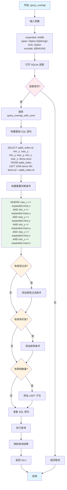
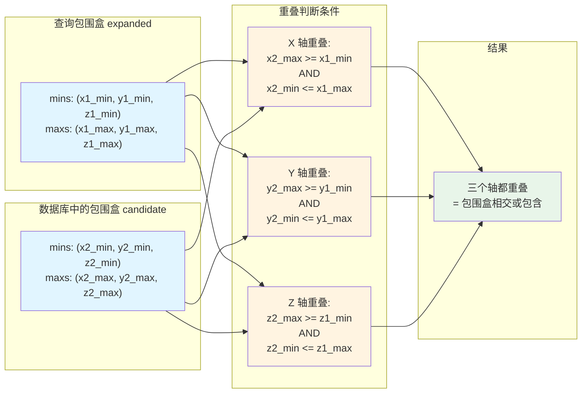
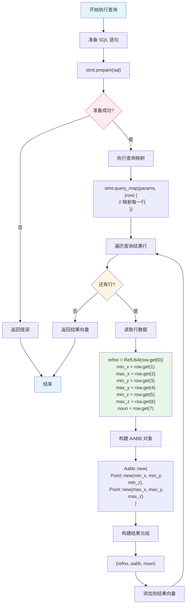
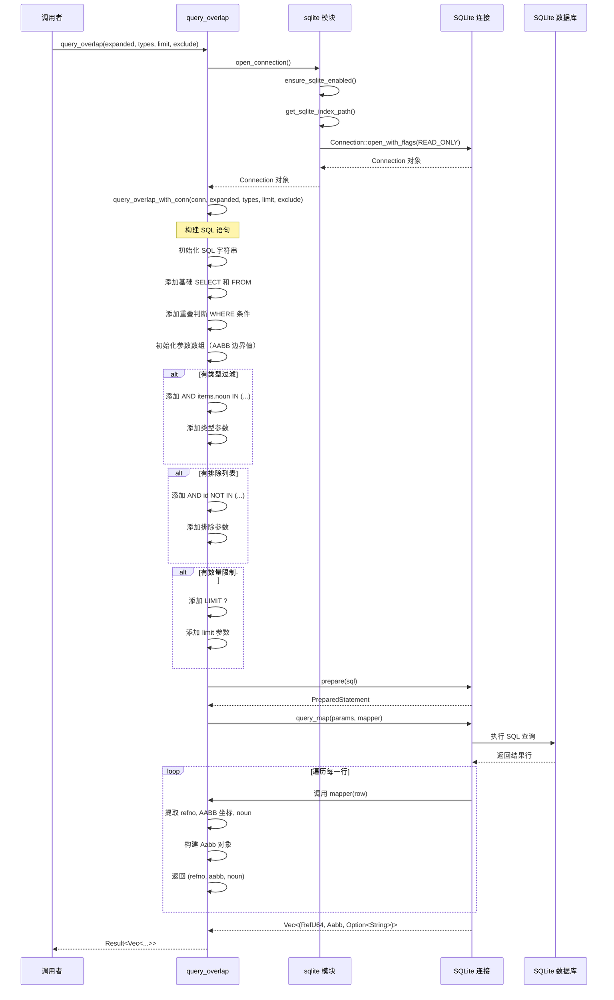
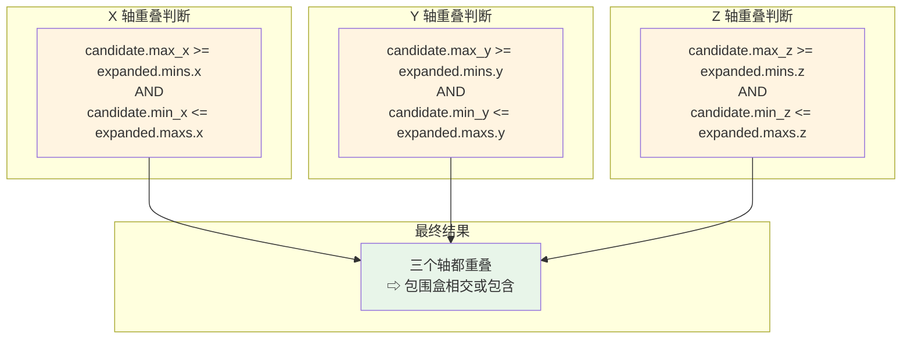
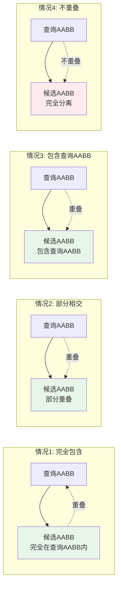
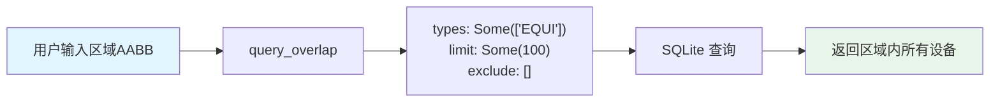
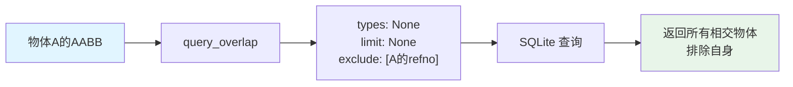
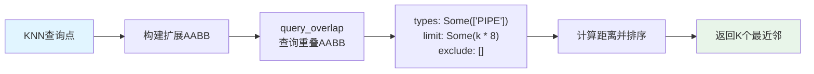

# 包围盒重叠查询流程图

本文档详细描述通过一个包围盒（AABB）查询所有和它相交或包含的包围盒数据的完整流程。

## 核心函数：query_overlap

### 函数签名
```rust
pub fn query_overlap(
    expanded: &Aabb,           // 查询的包围盒
    types: Option<&[String]>,   // 可选的类型过滤
    limit: Option<usize>,       // 可选的结果数量限制
    exclude: &[RefU64],         // 排除的参考号列表
) -> Result<Vec<(RefU64, Aabb, Option<String>)>>
```

## 1. 主流程图



## 2. SQL 构建详细流程

```mermaid
flowchart TD
    A[开始构建 SQL] --> B[初始化 SQL 字符串]
    B --> C["基础 SELECT 语句<br/>SELECT aabb_index.id, min_x, max_x,<br/>min_y, max_y, min_z, max_z, items.noun"]
    C --> D["FROM 子句<br/>FROM aabb_index<br/>LEFT JOIN items ON items.id = aabb_index.id"]
    D --> E["WHERE 子句 - 重叠判断<br/>WHERE max_x >= ?1 AND min_x <= ?2<br/>AND max_y >= ?3 AND min_y <= ?4<br/>AND max_z >= ?5 AND min_z <= ?6"]
    E --> F[初始化参数数组]
    F --> G["添加 AABB 参数<br/>expanded.mins.x, expanded.maxs.x<br/>expanded.mins.y, expanded.maxs.y<br/>expanded.mins.z, expanded.maxs.z"]
    G --> H{types 不为空?}
    H -->|是| I["添加类型过滤<br/>AND items.noun IN (?, ?, ...)"]
    I --> J[遍历 types 数组]
    J --> K[添加占位符 ?]
    K --> L[添加类型值到参数数组]
    L --> M{还有更多类型?}
    M -->|是| J
    M -->|否| N{exclude 不为空?}
    H -->|否| N
    N -->|是| O["添加排除条件<br/>AND aabb_index.id NOT IN (?, ?, ...)"]
    O --> P[遍历 exclude 数组]
    P --> Q[添加占位符 ?]
    Q --> R[添加 refno 值到参数数组]
    R --> S{还有更多排除项?}
    S -->|是| P
    S -->|否| T{limit 有值?}
    N -->|否| T
    T -->|是| U["添加限制<br/>LIMIT ?"]
    U --> V[添加 limit 值到参数数组]
    V --> W[SQL 构建完成]
    T -->|否| W
    W --> X[返回 SQL 和参数数组]
    
    style A fill:#e1f5ff
    style X fill:#e1f5ff
    style E fill:#e8f5e9
    style H fill:#fff4e1
    style N fill:#fff4e1
    style T fill:#fff4e1
```



## 3. 重叠判断算法原理



## 4. 查询执行和结果映射流程



## 5. 完整调用链流程图



## 6. 重叠判断条件详解

### 6.1 三维空间重叠判断

两个 AABB 在三维空间中重叠的条件是：**在所有三个坐标轴上都有重叠**。



### 6.2 重叠情况示例



## 7. 参数处理流程图

```mermaid
flowchart TD
    A[开始处理参数] --> B[初始化参数数组]
    B --> C["添加 AABB 边界参数<br/>[expanded.mins.x, expanded.maxs.x,<br/>expanded.mins.y, expanded.maxs.y,<br/>expanded.mins.z, expanded.maxs.z]"]
    C --> D{types 参数}
    D -->|Some(types)| E{types 非空?}
    D -->|None| H{exclude 参数}
    E -->|是| F["添加类型参数<br/>for each type in types:<br/>  params.push(type)"]
    E -->|否| H
    F --> H
    H -->|非空| I{exclude 非空?}
    H -->|空| L{limit 参数}
    I -->|是| J["添加排除参数<br/>for each refno in exclude:<br/>  params.push(refno.0 as i64)"]
    I -->|否| L
    J --> L
    L -->|Some(limit)| M["添加限制参数<br/>params.push(limit as i64)"]
    L -->|None| N[参数处理完成]
    M --> N
    N --> O[返回参数数组]
    
    style A fill:#e1f5ff
    style O fill:#e1f5ff
    style E fill:#fff4e1
    style I fill:#fff4e1
    style L fill:#fff4e1
```

## 8. 使用示例场景

### 场景1: 查询指定区域内的所有设备



### 场景2: 碰撞检测 - 查找与物体相交的其他物体



### 场景3: KNN 查询中的重叠查询



## 9. 性能优化要点

1. **索引利用**: SQLite 的 `aabb_index` 表应该有适当的索引来加速范围查询
2. **参数化查询**: 使用参数化查询防止 SQL 注入，同时提高查询计划缓存效率
3. **LEFT JOIN**: 使用 LEFT JOIN 确保即使 items 表中没有对应记录也能返回结果
4. **早期过滤**: 在 SQL 层面进行类型过滤和排除，减少数据传输量
5. **限制结果**: 使用 LIMIT 避免返回过多不必要的数据

## 10. SQL 查询示例

### 基础查询（无过滤）
```sql
SELECT aabb_index.id, min_x, max_x, min_y, max_y, min_z, max_z, items.noun
FROM aabb_index
LEFT JOIN items ON items.id = aabb_index.id
WHERE max_x >= ?1 AND min_x <= ?2
  AND max_y >= ?3 AND min_y <= ?4
  AND max_z >= ?5 AND min_z <= ?6
```

### 带类型过滤的查询
```sql
SELECT aabb_index.id, min_x, max_x, min_y, max_y, min_z, max_z, items.noun
FROM aabb_index
LEFT JOIN items ON items.id = aabb_index.id
WHERE max_x >= ?1 AND min_x <= ?2
  AND max_y >= ?3 AND min_y <= ?4
  AND max_z >= ?5 AND min_z <= ?6
  AND items.noun IN ('EQUI', 'PIPE', 'STRU')
```

### 完整查询（类型过滤 + 排除 + 限制）
```sql
SELECT aabb_index.id, min_x, max_x, min_y, max_y, min_z, max_z, items.noun
FROM aabb_index
LEFT JOIN items ON items.id = aabb_index.id
WHERE max_x >= ?1 AND min_x <= ?2
  AND max_y >= ?3 AND min_y <= ?4
  AND max_z >= ?5 AND min_z <= ?6
  AND items.noun IN ('EQUI', 'PIPE')
  AND aabb_index.id NOT IN (12345, 67890)
LIMIT 100
```

## 关键数据结构

- **输入**: `expanded: &Aabb` - 查询的包围盒
- **输出**: `Vec<(RefU64, Aabb, Option<String>)>` - 匹配的包围盒列表
  - `RefU64`: 参考号
  - `Aabb`: 包围盒坐标
  - `Option<String>`: 类型名称（noun），可能为 None

## 注意事项

1. **重叠 vs 包含**: 当前实现查询的是**相交或包含**的包围盒，包括：
   - 查询AABB包含候选AABB
   - 候选AABB包含查询AABB
   - 两个AABB部分相交

2. **性能考虑**: 
   - 对于大型数据集，建议使用适当的索引
   - 如果只需要"完全包含"的结果，需要在应用层进行额外过滤

3. **坐标系统**: 所有坐标都是世界坐标系下的值

4. **数据类型**: SQLite 中存储为 f64，返回时转换为 f32

## ⚠️ 重要说明：未使用 SQLite RTree 扩展

**当前实现并没有使用 SQLite 的 RTree 算法**，而是使用普通的 SQL 表加上 WHERE 条件进行范围查询。

### 当前实现方式
- 使用普通表 `aabb_index` 存储 AABB 数据
- 通过标准 SQL WHERE 条件进行重叠判断
- 性能依赖于普通索引（如果存在）

### SQLite RTree 扩展的特点
如果使用 SQLite RTree 扩展，应该：
1. 创建虚拟表：`CREATE VIRTUAL TABLE ... USING rtree(...)`
2. 使用特殊查询语法：`WHERE id MATCH rtree(...)`
3. 自动维护空间索引，查询性能更好

### 性能对比
- **当前方式（普通表）**: O(n) 全表扫描或依赖普通索引，大数据集性能较差
- **RTree 扩展**: O(log n) 空间索引查询，大数据集性能优秀

### 建议
如果需要提升空间查询性能，可以考虑：
1. 迁移到 SQLite RTree 扩展
2. 使用内存中的 RTree（代码中已有 `rstar` 库实现）
3. 在 `aabb_index` 表上创建复合索引：`CREATE INDEX idx_aabb ON aabb_index(min_x, max_x, min_y, max_y, min_z, max_z)`

