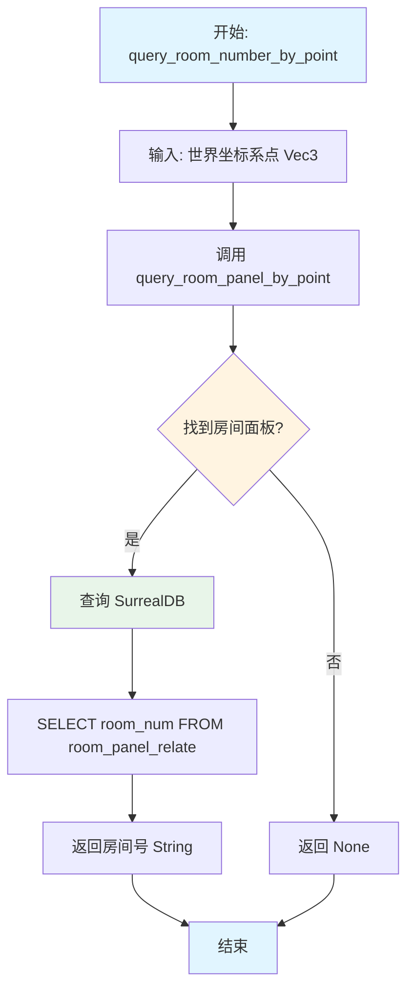
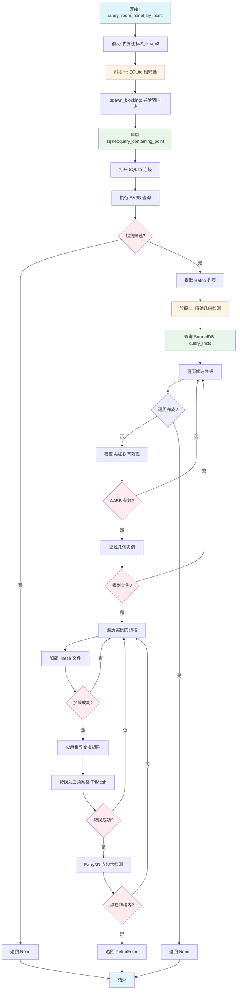
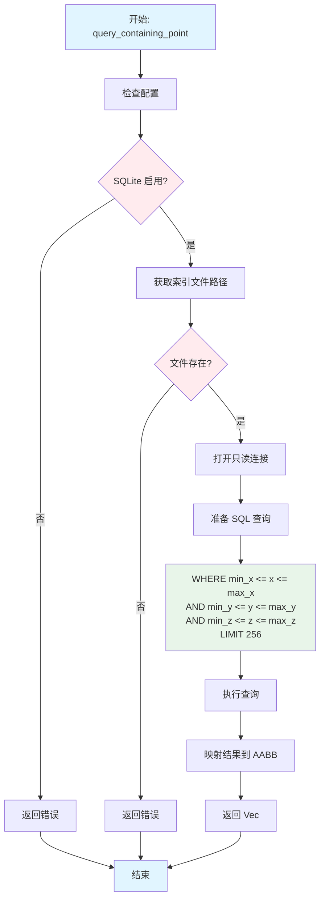
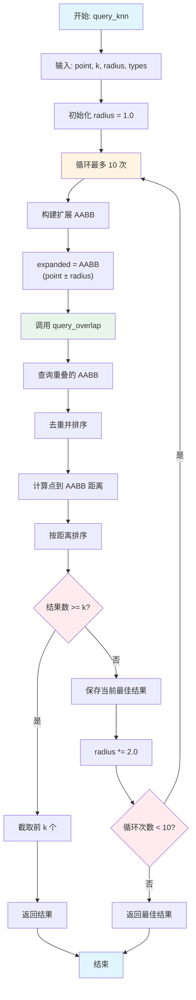
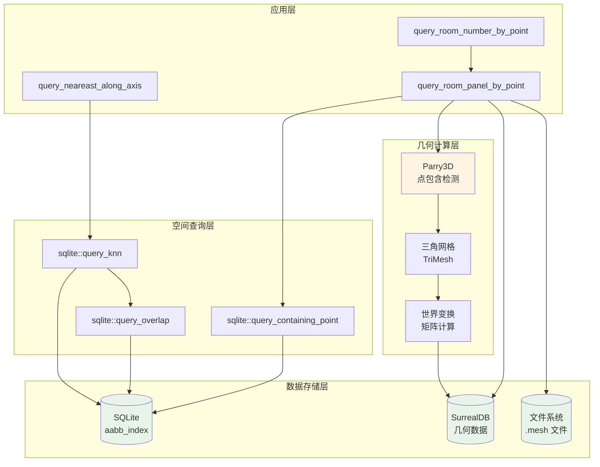
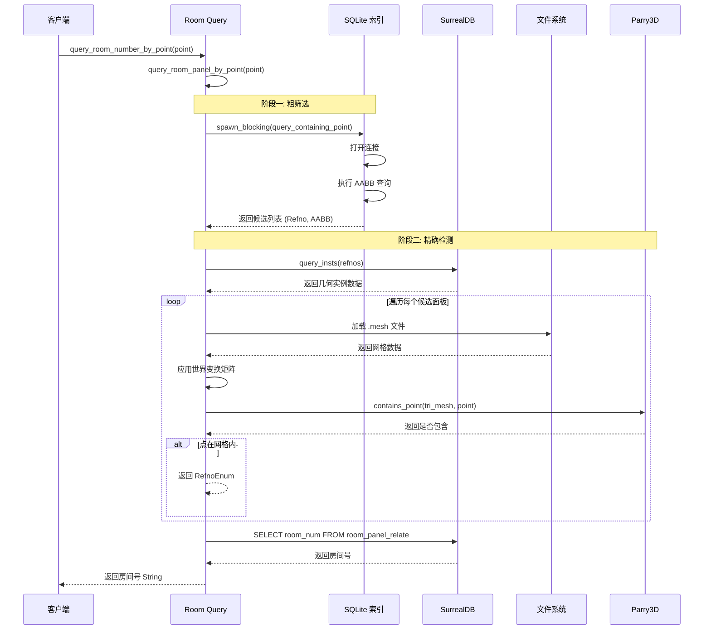
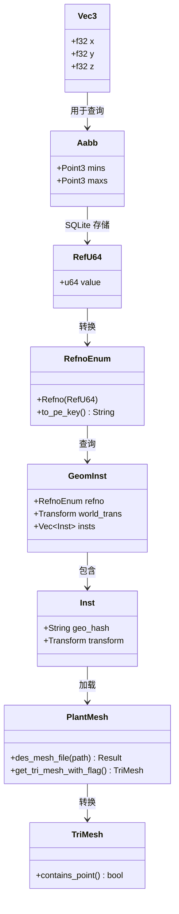

# 空间计算流程图

本文档描述了使用 SQLite 进行空间计算和房间查询的完整流程。

## 1. 房间号查询主流程



## 2. 房间面板查询详细流程（两阶段查询）



## 3. SQLite 空间索引查询流程



## 4. KNN 查询流程（K 近邻）



## 5. 重叠查询流程（query_overlap）

```mermaid
flowchart TD
    A[开始: query_overlap] --> B[输入: AABB, types, limit, exclude]
    B --> C[构建基础 SQL]
    C --> D["SELECT FROM aabb_index<br/>LEFT JOIN items"]
    D --> E["WHERE AABB 重叠条件<br/>max_x >= min_x AND min_x <= max_x<br/>..."]
    E --> F{有类型过滤?}
    F -->|是| G[添加 AND items.noun IN (...)]
    F -->|否| H{有排除列表?}
    G --> H
    H -->|是| I[添加 AND id NOT IN (...)]
    H -->|否| J{有限制数量?}
    I --> J
    J -->|是| K[添加 LIMIT]
    J -->|否| L[执行查询]
    K --> L
    L --> M[映射结果]
    M --> N[返回 Vec<RefU64, Aabb, noun>]
    N --> O[结束]
    
    style A fill:#e1f5ff
    style O fill:#e1f5ff
    style F fill:#ffebee
    style H fill:#ffebee
    style J fill:#ffebee
    style D fill:#e8f5e9
```

## 6. 系统架构图



## 7. 数据流图



## 8. 关键数据结构



## 关键性能优化点

1. **两阶段查询**：先用 AABB 粗筛选，再用精确几何检测
2. **异步转同步**：使用 `spawn_blocking` 避免阻塞异步运行时
3. **限制候选数量**：SQLite 查询限制为 256 个候选
4. **早期退出**：找到第一个匹配即返回
5. **只读连接**：SQLite 使用只读模式提高性能
6. **批量查询**：SurrealDB 批量查询几何实例

## 配置要求

- `DbOption.enable_sqlite_rtree = true`
- `DbOption.sqlite_index_path` 指向有效的 SQLite 文件
- SQLite 文件必须包含 `aabb_index` 表
- SurrealDB 必须包含 `room_panel_relate` 关系表
- 网格文件必须存在于 `assets/meshes/` 目录


