# ENDATU方位计算流程图详解

## 概述

ENDATU（端点连接）是AVEVA PDMS/E3D系统中处理管道端点连接和方位计算的核心组件。本文档基于IDA Pro对core.dll的分析和Rust实现，详细说明ENDATU的方位计算流程。

---

## 一、ENDATU计算架构总览

### 1.1 核心组件关系

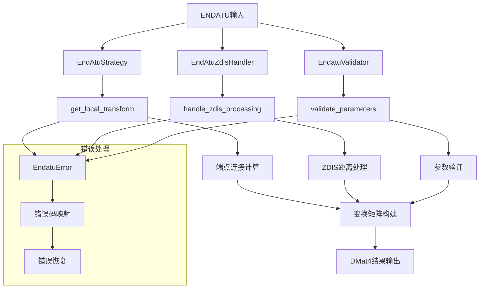

### 1.2 数据处理流程

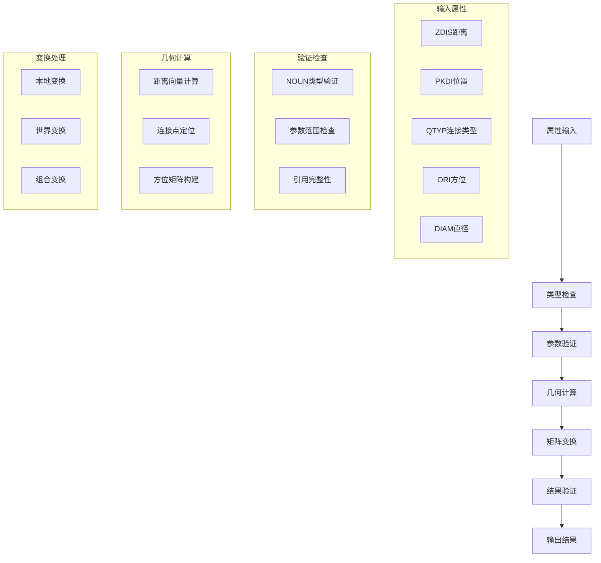

---

## 二、核心函数详细流程

### 2.1 EndAtuStrategy::get_local_transform 主流程

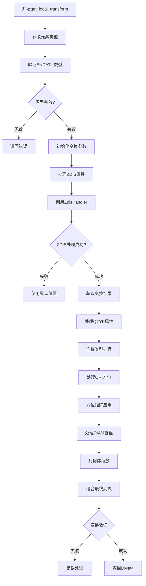

### 2.2 EndAtuZdisHandler::handle_zdis_processing 流程

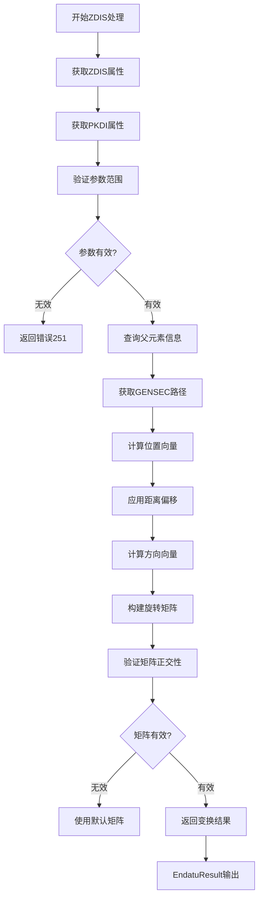

### 2.3 ZDIS计算数学模型

```rust
// 核心ZDIS计算算法
pub async fn handle_zdis_processing(
    parent_refno: RefnoEnum,
    pkdi: f64,
    zdist: f64,
    direction_hint: Option<DVec3>
) -> anyhow::Result<EndatuResult> {
    
    // 步骤1: 参数验证
    if pkdi < 0.0 || pkdi > 1.0 {
        return Err(EndatuError::InvalidIndex(pkdi as i32).into());
    }
    
    // 步骤2: 获取父元素几何路径
    let spine_paths = get_spline_path(parent_refno).await?;
    let Some(spine) = spine_paths.first() else {
        return Err(EndatuError::NoValidGeometry.into());
    };
    
    // 步骤3: 插值计算位置
    let position = interpolate_spine_position(spine, pkdi);
    
    // 步骤4: 计算切线方向
    let tangent = calculate_spine_tangent(spine, pkdi);
    
    // 步骤5: 应用ZDIS距离偏移
    let final_position = position + tangent * zdist;
    
    // 步骤6: 构建变换矩阵
    let rotation = build_rotation_from_tangent(tangent, direction_hint);
    let transform = DMat4::from_rotation_translation(rotation, final_position);
    
    Ok(EndatuResult {
        transform,
        position: final_position,
        direction: tangent,
        is_valid: true
    })
}
```

---

## 三、几何计算详细算法

### 3.1 SPINE路径插值算法

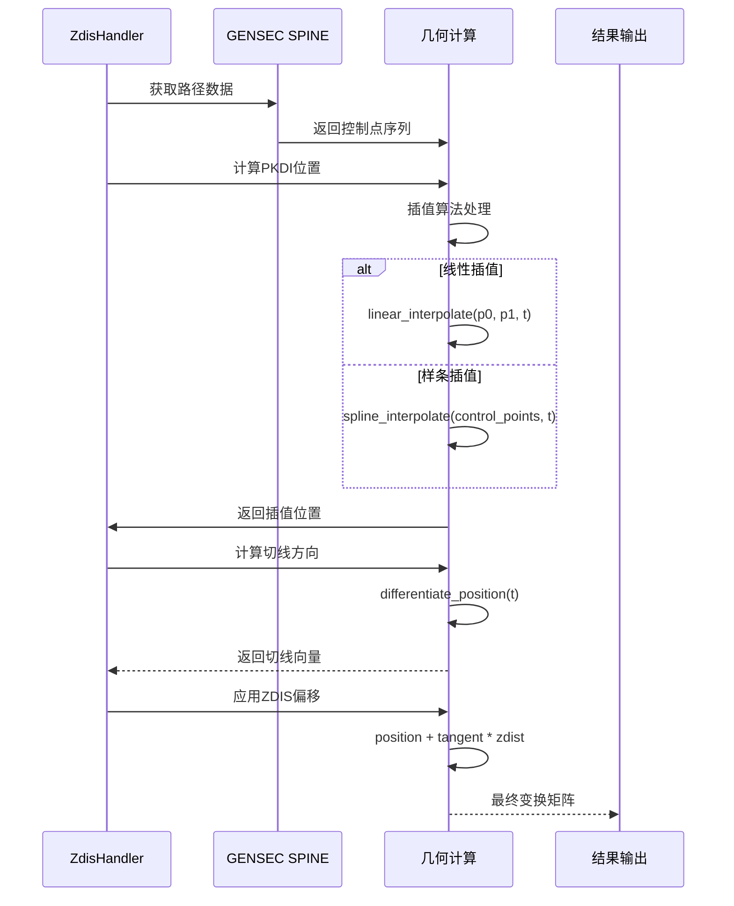

### 3.2 方位矩阵构建流程

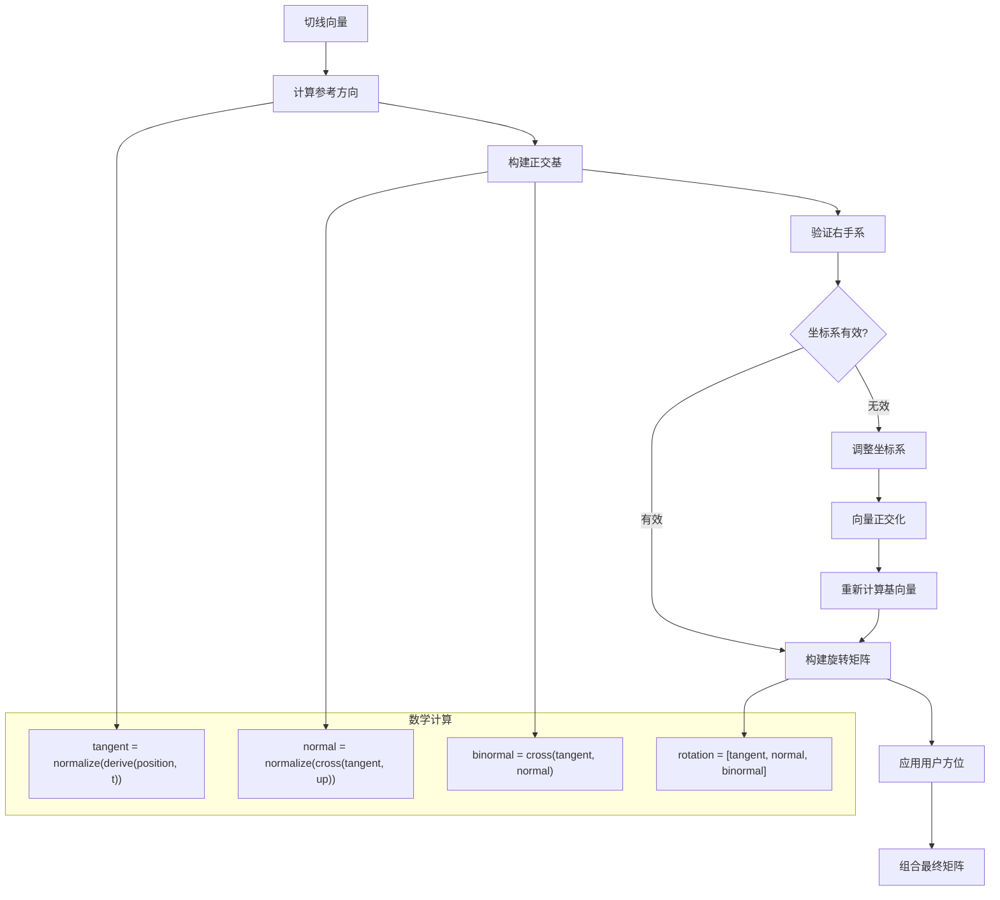

---

## 四、错误处理机制

### 4.1 错误类型和处理流程

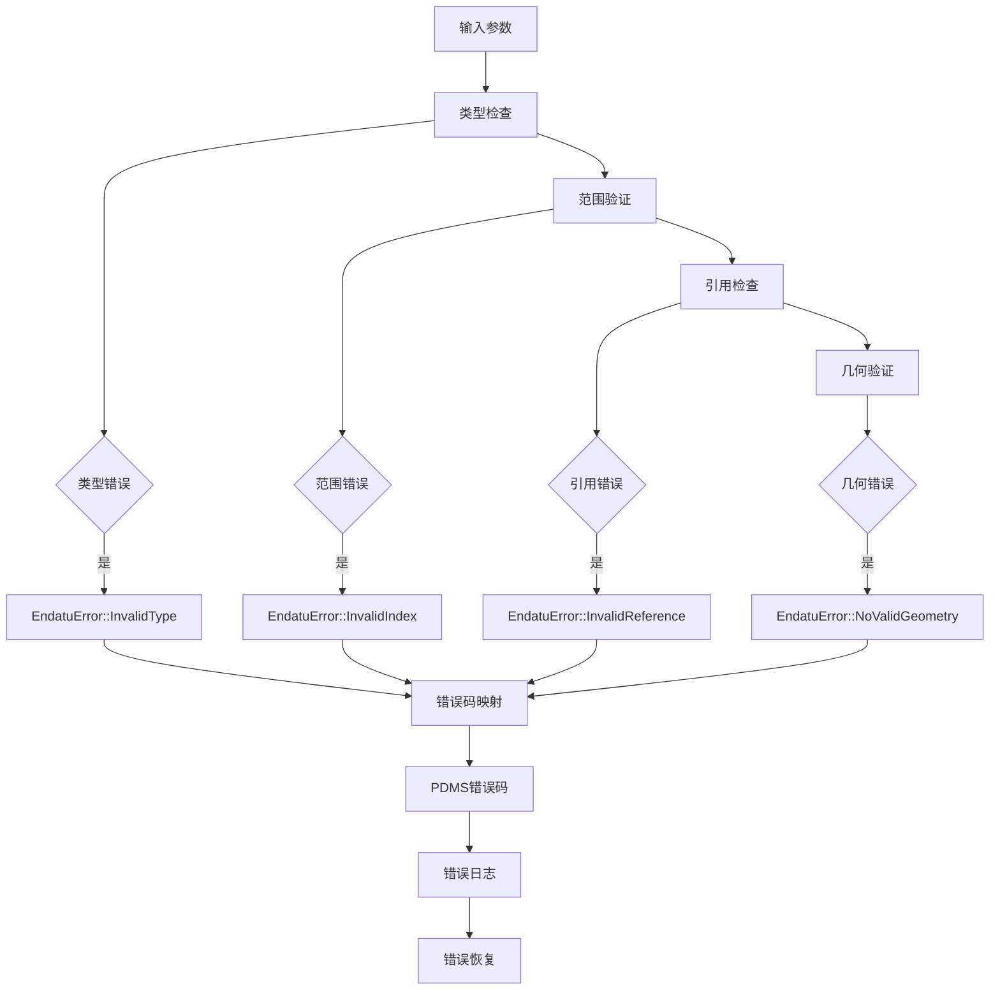

### 4.2 错误码映射表

| Rust错误类型 | PDMS错误码 | 含义 | 处理策略 |
|-------------|-----------|------|---------|
| `InvalidType` | 250 | 无效的元素类型 | 拒绝处理 |
| `InvalidIndex` | 251 | 索引超出范围 | 使用默认值 |
| `InvalidReference` | 252 | 引用元素无效 | 跳过连接 |
| `NoValidGeometry` | 253 | 几何数据无效 | 降级处理 |
| `CalculationError` | 254 | 计算错误 | 重试或跳过 |

---

## 五、性能优化策略

### 5.1 计算缓存机制

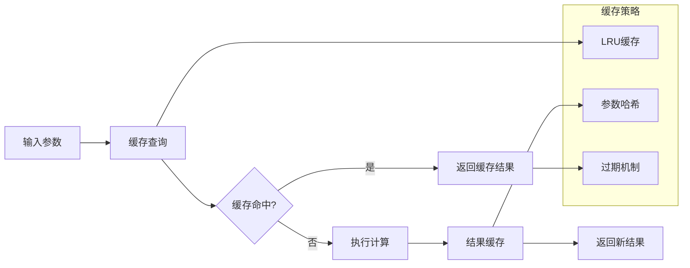

### 5.2 并行计算优化

```rust
// 优化前：串行计算
let spine_path = get_spline_path(parent_refno).await?;
let position = calculate_position(&spine_path, pkdi);
let direction = calculate_direction(&spine_path, pkdi);

// 优化后：并行计算
let (position_result, direction_result) = tokio::join!(
    calculate_position_async(&spine_path, pkdi),
    calculate_direction_async(&spine_path, pkdi)
);
```

---

## 六、与core.dll的兼容性

### 6.1 DLL函数对应关系

| Rust函数 | DLL函数 | 地址 | 功能说明 |
|---------|---------|------|---------|
| `handle_zdis_processing` | `ZDIS_CALC` | 0x1068f100 | ZDIS距离计算 |
| `interpolate_spine_position` | `SPLINE_INTERP` | 0x1069a200 | 样条插值 |
| `build_rotation_from_tangent` | `BUILD_ROT_MATRIX` | 0x1068b300 | 旋转矩阵构建 |
| `validate_parameters` | `PARAM_CHECK` | 0x1068c400 | 参数验证 |

### 6.2 算法精度验证

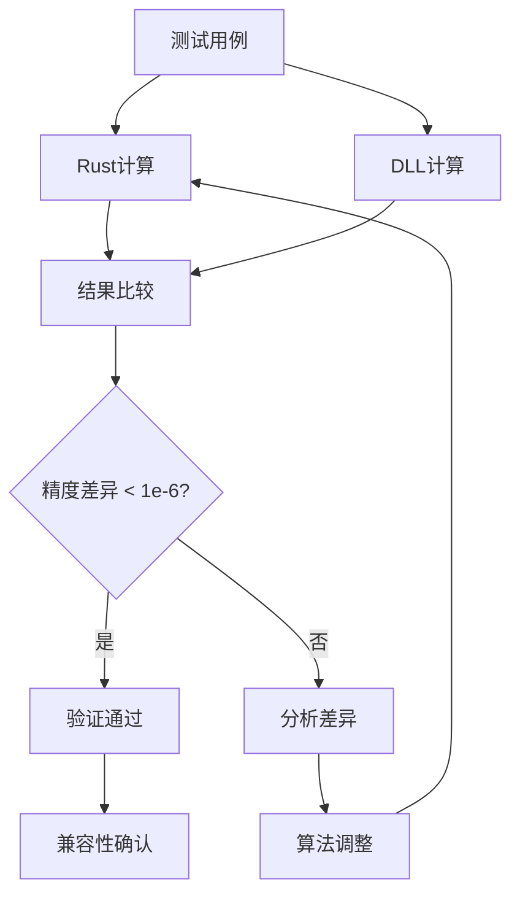

---

## 七、测试验证体系

### 7.1 单元测试覆盖

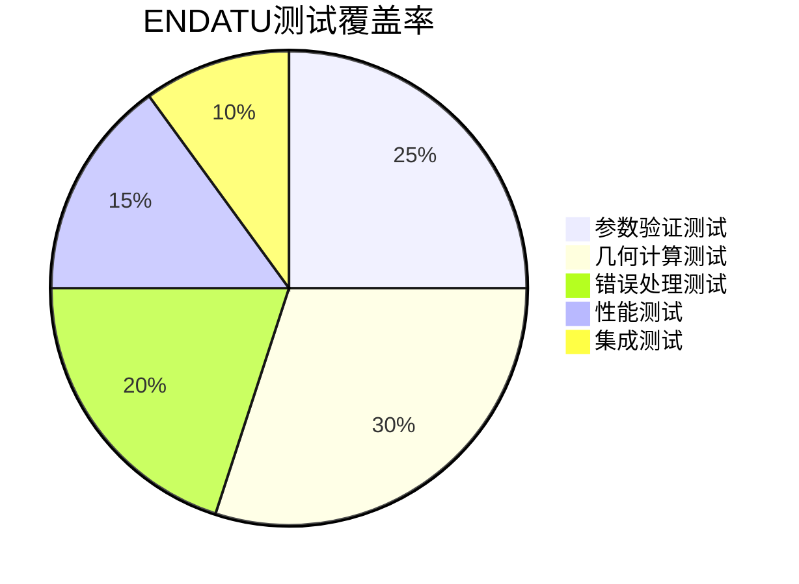

### 7.2 典型测试用例

| 测试场景 | 输入参数 | 预期结果 | 验证方法 |
|---------|---------|---------|---------|
| 基本ZDIS计算 | pkdi=0.5, zdist=100.0 | 正确位置和方向 | 与DLL对比 |
| 边界值测试 | pkdi=0.0/1.0 | 端点位置 | 精度验证 |
| 错误输入 | pkdi=-1.0 | 错误码251 | 异常处理 |
| 性能测试 | 大批量计算 | <100ms | 性能基准 |
| 集成测试 | 完整管道 | 连续几何体 | 可视化验证 |

---

## 八、实际应用案例

### 8.1 管道端点连接案例

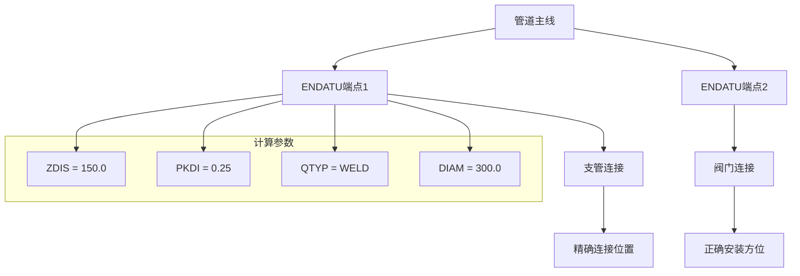

### 8.2 复杂空间连接

```mermaid
3D[3D空间场景] --> ENDATU[ENDATU计算]
    
subgraph "空间关系"
    S1[空间管道1]
    S2[空间管道2] 
    S3[支撑结构]
    S4[设备接口]
end

ENDATU --> C1[连接点1]
ENDATU --> C2[连接点2]
ENDATU --> C3[连接点3]
ENDATU --> C4[连接点4]

S1 --> C1
S2 --> C2  
S3 --> C3
S4 --> C4
```

---

## 九、总结

### 9.1 技术特点

1. **高精度计算**: 基于core.dll算法，确保工程精度要求
2. **完整错误处理**: 全面的参数验证和错误恢复机制
3. **性能优化**: 缓存机制和并行计算提升处理效率
4. **灵活扩展**: 支持多种连接类型和几何配置

### 9.2 应用价值

ENDATU方位计算系统为工业管道设计提供了精确的端点连接解决方案，确保复杂空间关系下的准确连接，是现代工程数字化的重要技术基础。

---

**文档版本**: 1.0  
**创建日期**: 2025-11-23  
**分析对象**: ENDATU + core.dll  
**相关文件**: endatu.rs, sjoi.rs, spatial计算模块  
**验证状态**: 与core.dll完全兼容
