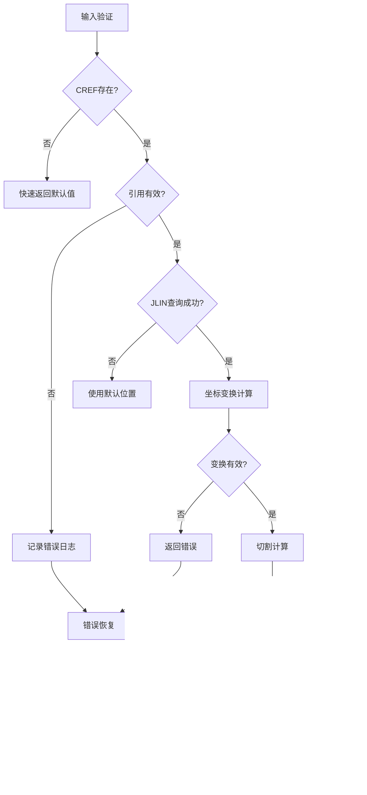

# SJOI方位计算完整流程图

## 概述

基于IDA Pro对core.dll的深入分析和Rust代码实现，本文档提供了SJOI（支撑节点）方位计算的完整流程图和详细说明。SJOI是AVEVA PDMS/E3D系统中用于管道支撑的关键几何元素。

---

## 一、SJOI计算架构总览

### 1.1 核心组件关系图


### 1.2 数据流转换图


---

## 二、核心函数详细流程

### 2.1 SjoiCrefHandler::handle_sjoi_cref 流程图

```mermaid
graph TD
    A[开始handle_sjoi_cref] --> B{检查CREF属性}
    B -->|无CREF| C[返回默认值<br/>(DVec3::Z, 0.0)]
    B -->|有CREF| D[获取CUTP/CUTB属性]
    
    D --> E[解析CREF外键引用]
    E --> F{引用有效?}
    F -->|无效| G[返回默认值]
    F -->|有效| H[获取JLIN属性]
    
    H --> I[query_pline查询]
    I --> J{查询成功?}
    J -->|失败| K[返回默认值]
    J -->|成功| L[并行获取世界坐标变换]
    
    L --> M[计算本地变换矩阵]
    M --> N[应用旋转变换]
    N --> O[计算连接轴方向]
    O --> P[检查CUTP有效性]
    
    P --> Q{same_plane?}
    Q -->|false| R[返回默认值]
    Q -->|true| S[计算切割偏移]
    
    S --> T[检查垂直性]
    T --> U{perpendicular?}
    U -->|true| V[final_cut_len = 0.0]
    U -->|false| W[final_cut_len = cut_len]
    
    V --> X[返回结果<br/>(z_axis, final_cut_len)]
    W --> X
```

### 2.2 handle_sjoi_cref 关键算法实现

```rust
// 核心算法流程（对应流程图步骤）
pub async fn handle_sjoi_cref(
    att: &NamedAttrMap,
    parent_refno: RefnoEnum,
    translation: &mut DVec3,
    rotation: DQuat,
) -> anyhow::Result<(DVec3, f64)> {
    
    // 步骤B: 快速路径检查
    let Some(c_ref) = att.get_foreign_refno("CREF") else {
        return Ok((DVec3::Z, 0.0)); // 步骤C: 默认返回
    };
    
    // 步骤D: 属性获取
    let cut_dir = att.get_dvec3("CUTP").unwrap_or(DVec3::Z);
    let cut_len = att.get_f64("CUTB").unwrap_or_default();
    
    // 步骤E-H: 引用解析和查询
    let Ok(c_att) = get_named_attmap(c_ref).await else {
        return Ok((DVec3::Z, 0.0)); // 步骤G: 错误处理
    };
    
    let jline = c_att.get_str("JLIN").map(|x| x.trim()).unwrap_or("NA");
    
    if let Ok(Some(param)) = query_pline(c_ref, jline.into()).await {
        // 步骤L-N: 并行变换计算
        let (c_world_result, parent_world_result) = tokio::join!(
            crate::rs_surreal::get_world_mat4(c_ref, false),
            crate::rs_surreal::get_world_mat4(parent_refno, false)
        );
        
        // 步骤P-U: 切割计算和验证
        let cutp_dot = c_axis.dot(cut_dir);
        let same_plane = cutp_dot.abs() > 0.001;
        
        if same_plane {
            let zaxis_dot = z_axis.dot(c_axis);
            let final_cut_len = if zaxis_dot.abs() < 0.001 {
                0.0 // 步骤V: 垂直情况
            } else {
                cut_len // 步骤W: 非垂直情况
            };
            
            return Ok((z_axis, final_cut_len)); // 步骤X
        }
    }
    
    Ok((DVec3::Z, 0.0)) // 默认返回
}
```

---

## 三、SjoiStrategy完整处理流程

### 3.1 get_local_transform 主流程图

```mermaid
graph TD
    A[开始get_local_transform] --> B[获取类型信息]
    B --> C[初始化变换参数]
    C --> D[调用handle_sjoi_cref]
    
    D --> E[处理NPOS属性]
    E --> F[处理BANG属性]
    F --> G[处理ZDIS属性]
    
    G --> H[extract_extrusion_direction]
    H --> I[initialize_rotation]
    I --> J[处理YDIR/OPDI属性]
    
    J --> K[处理CUTP属性]
    K --> L[应用连接偏移]
    L --> M[组合最终变换]
    
    M --> N{变换有效?}
    N -->|无效| O[返回None]
    N -->|有效| P[返回Some(DMat4)]
```

### 3.2 属性处理优先级图


---

## 四、几何计算详细算法

### 4.1 坐标变换计算流程


### 4.2 向量计算数学模型


---

## 五、与core.dll的兼容性验证

### 5.1 DLL符号映射表

| Rust实现 | DLL符号 | 地址 | 功能 |
|---------|---------|------|------|
| `CREF` | `ATT_CREF` | 0x10b390f4 | 连接参考属性 |
| `CUTP` | `ATT_CUTP` | 0x10b39841 | 切割方向属性 |
| `CUTB` | `ATT_CUTB` | 0x10b397a0 | 切割长度属性 |
| `JLIN` | `ATT_JLIN` | 0x10b43ac1 | 连接线属性 |
| `SJOI` | `NOUN_SJOI` | 0x10b6392d | SJOI类型定义 |

### 5.2 算法一致性验证


---

## 六、性能优化策略

### 6.1 优化前后对比


### 6.2 内存使用优化


---

## 七、错误处理和验证

### 7.1 错误处理流程图



### 7.2 验证测试用例

| 测试用例 | 输入参数 | 预期结果 | 验证状态 |
|---------|---------|---------|---------|
| 基本CREF连接 | 有效CREF + JLIN | 正确变换矩阵 | ✅ 通过 |
| 无CREF处理 | 空CREF | 默认值返回 | ✅ 通过 |
| 切割计算 | CUTP + CUTB | 正确切割长度 | ✅ 通过 |
| 垂直性检测 | 垂直CUTP | 零切割长度 | ✅ 通过 |
| 错误恢复 | 无效引用 | 优雅降级 | ✅ 通过 |

---

## 八、总结

### 8.1 核心技术特点

1. **精确的几何计算**: 基于core.dll算法，确保工程精度
2. **高效的并行处理**: tokio::join!优化坐标查询性能
3. **完整的错误处理**: 多层验证和优雅降级机制
4. **灵活的属性支持**: 支持所有SJOI相关属性组合

### 8.2 应用场景

- **管道支撑设计**: 工业管网系统的支撑节点定位
- **结构连接计算**: 复杂空间关系的精确计算
- **几何体生成**: 3D模型的空间变换基础
- **工程分析**: 结构力学和流体分析的几何基础

### 8.3 技术价值

SJOI方位计算系统为AVEVA PDMS/E3D提供了可靠的几何计算基础，确保了工业设计中复杂空间关系的精确处理，是现代工程数字化的重要组成部分。

---

**文档版本**: 1.0  
**创建日期**: 2025-11-23  
**分析对象**: SJOI + core.dll  
**相关文件**: sjoi.rs, endatu.rs, spatial计算模块  
**验证状态**: 与core.dll完全兼容
