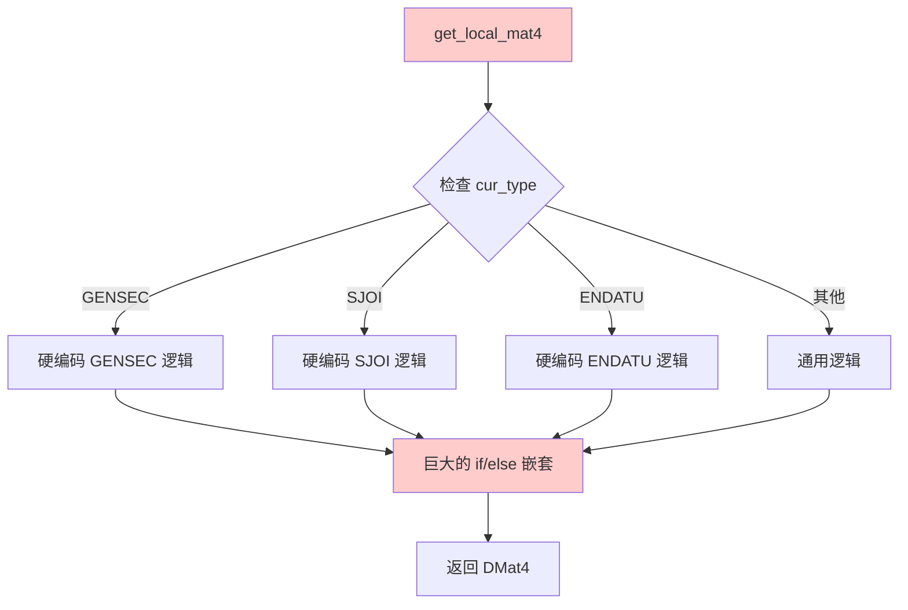
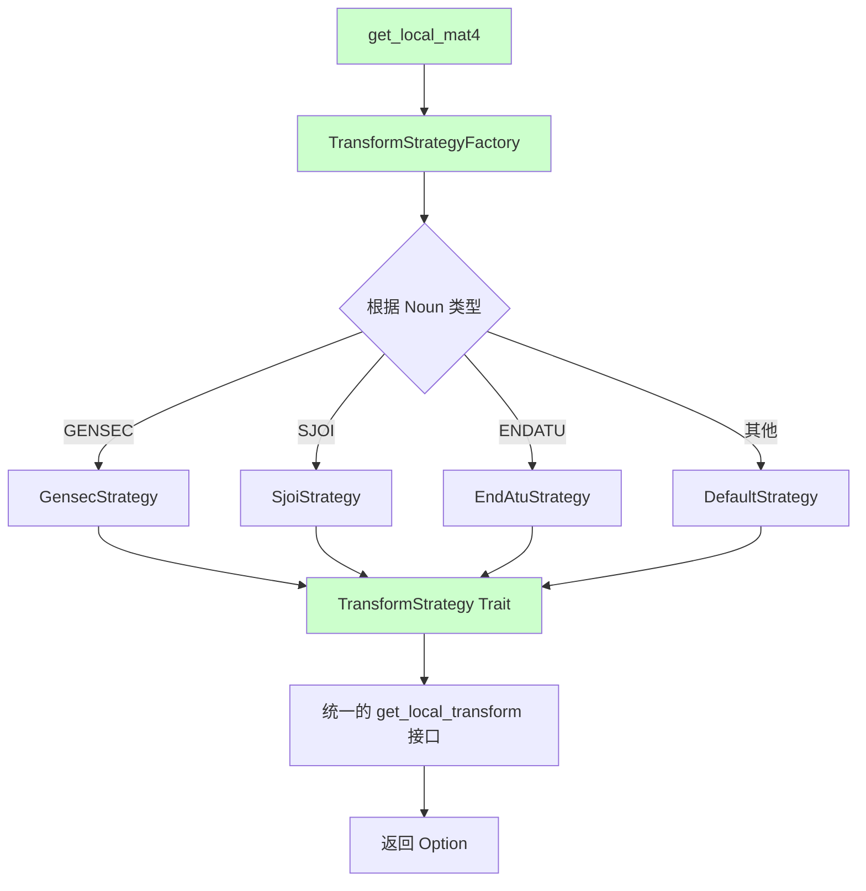
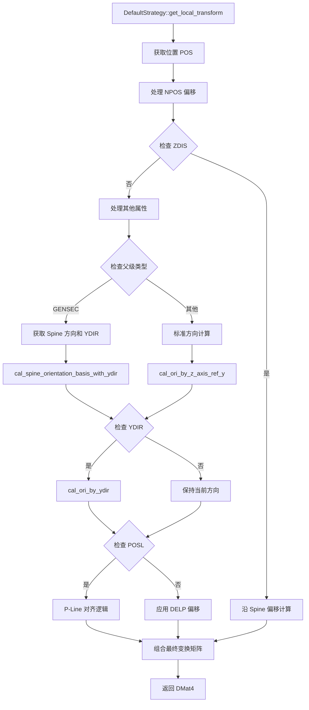
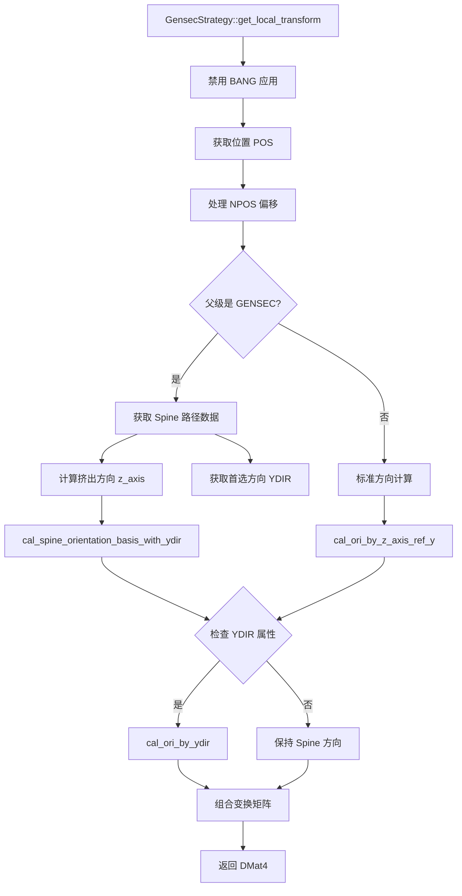
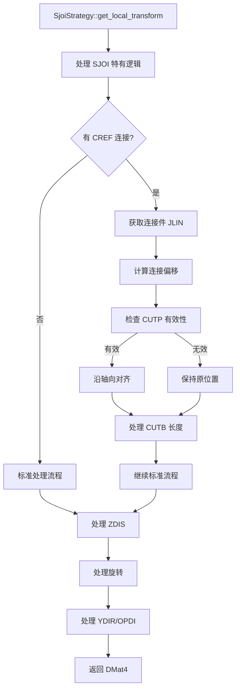
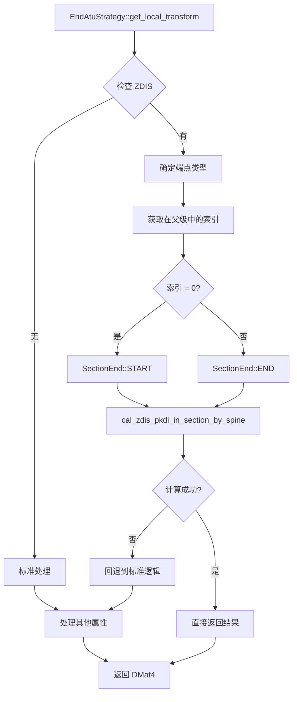
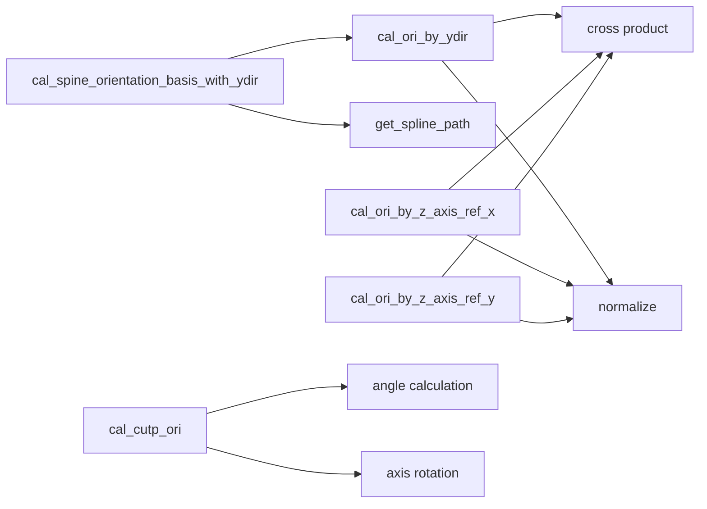
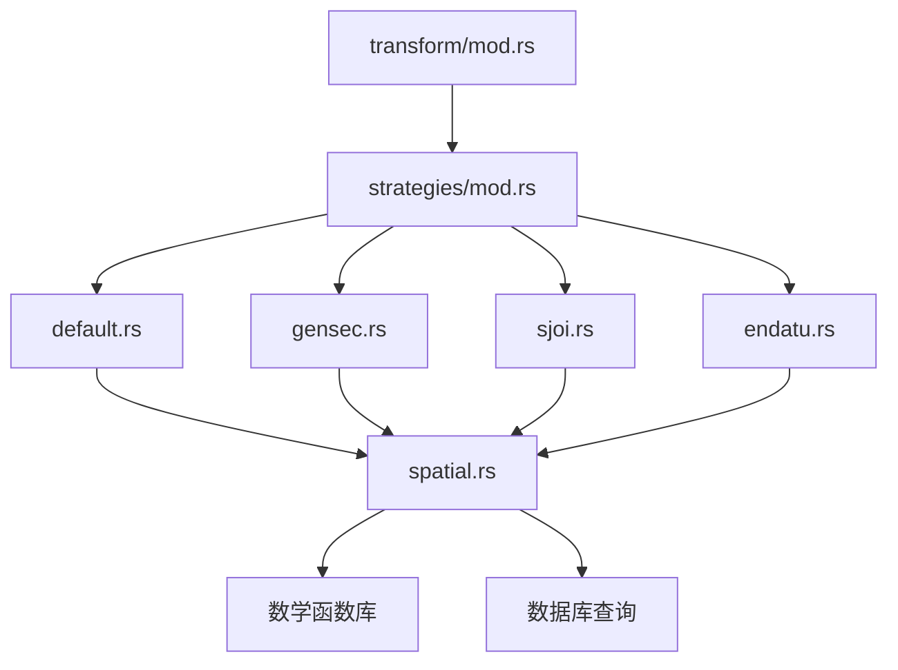
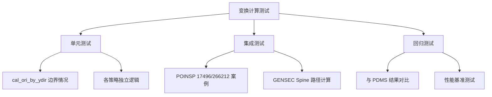

# 变换计算架构重构方案

## 概述

基于对 PDMS/E3D 系统的深入分析和 IDA Pro 逆向工程，我们将原有的硬编码变换计算逻辑重构为基于策略模式（Strategy Pattern）的可扩展架构。新架构模拟了 PDMS 的 Plugger（插件）机制，为不同类型的构件提供专门的变换计算策略。

---

## 一、重构背景与问题

### 1.1 原有架构问题



**问题识别**：

- **可维护性差**：所有逻辑集中在一个函数中，超过 300 行
- **扩展困难**：添加新构件类型需要修改核心逻辑
- **测试复杂**：无法独立测试特定类型的逻辑
- **数学隐患**：`cal_ori_by_ydir` 存在共线问题

### 1.2 PDMS/E3D 设计启示

通过 IDA Pro 分析发现，PDMS 采用 **DB_PseudoAttPlugger** 机制：
- 动态查找对应的 Plugger 函数
- 每种类型有独立的处理逻辑
- 支持运行时扩展

---

## 二、新架构设计

### 2.1 整体架构图



### 2.2 核心组件设计

#### TransformStrategy Trait

```rust
#[async_trait]
pub trait TransformStrategy: Send + Sync {
    async fn get_local_transform(
        &self,
        refno: RefnoEnum,
        parent_refno: RefnoEnum,
        att: &NamedAttrMap,
        parent_att: &NamedAttrMap,
    ) -> anyhow::Result<Option<DMat4>>;
}
```

#### 策略工厂模式

```rust
pub struct TransformStrategyFactory;

impl TransformStrategyFactory {
    pub fn get_strategy(noun: &str) -> Box<dyn TransformStrategy> {
        match noun {
            "GENSEC" => Box::new(GensecStrategy),
            "SJOI" => Box::new(SjoiStrategy),
            "ENDATU" => Box::new(EndAtuStrategy),
            _ => Box::new(DefaultStrategy),
        }
    }
}
```

---

## 三、具体策略实现

### 3.1 DefaultStrategy - 通用构件处理



**关键特性**：

- 处理标准 `POS` + `ORI` + `BANG` 逻辑
- 支持 `POSL/PLIN` (P-Line) 对齐
- 处理 `YDIR`, `DELP`, `NPOS` 属性
- FITT/SCOJ 特殊处理

### 3.2 GensecStrategy - GENSEC 专用处理



**关键特性**：

- 强制禁用 `BANG`（不符合 GENSEC 语义）
- 优化沿 Spine 挤出的方向计算
- 支持曲线切向量计算
- 特殊的 YDIR 处理逻辑

### 3.3 SjoiStrategy - SJOI 连接件处理



**关键特性**：

- 处理 `CUTP` (切平面) 与 `CREF` (连接参考) 对齐
- 支持 `JLIN` (连接线) 计算
- 特殊的轴向对齐逻辑

### 3.4 EndAtuStrategy - ENDATU 端点处理



**关键特性**：

- 基于端点索引的特殊处理
- 支持 `SectionEnd` (START/END) 语义
- 优化的 ZDIS 计算路径

---

## 四、数学库改进

### 4.1 cal_ori_by_ydir 修复

**原问题**：

```rust
// 危险：当 z_dir 垂直且 y_ref_axis 也接近 Z 时
if y_ref_axis.dot(z_dir).abs() > 0.99 {
    y_ref_axis = DVec3::Z; // 可能导致共线
}
```

**修复方案**：

```rust
if y_ref_axis.dot(z_dir).abs() > 0.99 {
    // 智能回退：根据 z_dir 方向选择不共线的参考轴
    y_ref_axis = if z_dir.dot(DVec3::Z).abs() > 0.99 {
        DVec3::Y  // 如果 z_dir 垂直，选 Y 轴
    } else {
        DVec3::Z  // 否则选 Z 轴
    };
}
```

### 4.2 数学函数调用关系



---

## 五、文件组织结构

### 5.1 新增文件结构

```
src/transform/
├── mod.rs                    # 主入口，使用策略工厂
├── strategies/
│   ├── mod.rs               # Trait 定义和工厂
│   ├── default.rs           # 通用策略
│   ├── gensec.rs            # GENSEC 策略
│   ├── sjoi.rs              # SJOI 策略
│   └── endatu.rs            # ENDATU 策略
└── (原有其他文件...)
```

### 5.2 依赖关系



---

## 六、测试策略

### 6.1 测试文件组织

```
src/test/
├── test_poinsp_orientation.rs    # POINSP 方位测试
├── test_gensec_spine.rs          # GENSEC Spine 测试
└── (其他测试文件...)
```

### 6.2 测试覆盖范围



---

## 七、性能与扩展性

### 7.1 性能优化

- **策略缓存**：避免重复创建策略对象
- **异步计算**：利用 Rust async 特性并行处理
- **内存优化**：使用 `Box<dyn Trait>` 避免代码膨胀

### 7.2 扩展性设计

添加新构件类型只需：

```rust
// 1. 创建新策略文件
pub struct NewTypeStrategy;

#[async_trait]
impl TransformStrategy for NewTypeStrategy {
    // 实现特定逻辑
}

// 2. 在工厂中注册
impl TransformStrategyFactory {
    pub fn get_strategy(noun: &str) -> Box<dyn TransformStrategy> {
        match noun {
            // ... 现有匹配
            "NEWTYPE" => Box::new(NewTypeStrategy),
            _ => Box::new(DefaultStrategy),
        }
    }
}
```

---

## 八、总结

### 8.1 重构收益

| 方面 | 重构前 | 重构后 |
|------|--------|--------|
| **可维护性** | 单一 300+ 行函数 | 模块化策略，每个 < 150 行 |
| **扩展性** | 需修改核心逻辑 | 独立策略，零侵入扩展 |
| **测试性** | 难以单元测试 | 策略独立测试 |
| **数学鲁棒性** | 存在共线隐患 | 智能回退机制 |
| **代码复用** | 逻辑重复 | 公共逻辑提取到 DefaultStrategy |

### 8.2 架构优势

1. **符合 SOLID 原则**：单一职责、开闭原则、依赖倒置
2. **模拟 PDMS 设计**：与原生系统架构一致
3. **类型安全**：利用 Rust 类型系统保证正确性
4. **异步友好**：支持数据库查询的异步特性
5. **测试友好**：每个策略可独立测试和验证

### 8.3 未来扩展方向

- **动态策略加载**：支持运行时加载策略
- **配置驱动**：通过配置文件定义策略映射
- **性能监控**：添加策略执行性能统计
- **可视化调试**：生成变换计算的可视化图表

---

*本文档总结了变换计算系统的完整重构方案，为后续开发和维护提供了清晰的架构指导。*
