# 方位计算架构总览图

## 概述

本文档通过一系列Mermaid流程图，全面展示AVEVA PDMS/E3D系统中方位计算的整体架构，包括SJOI、ENDATU、GENSEC等核心组件的相互关系和数据流向。

---

## 🏗️ 系统架构总览

### 整体系统架构

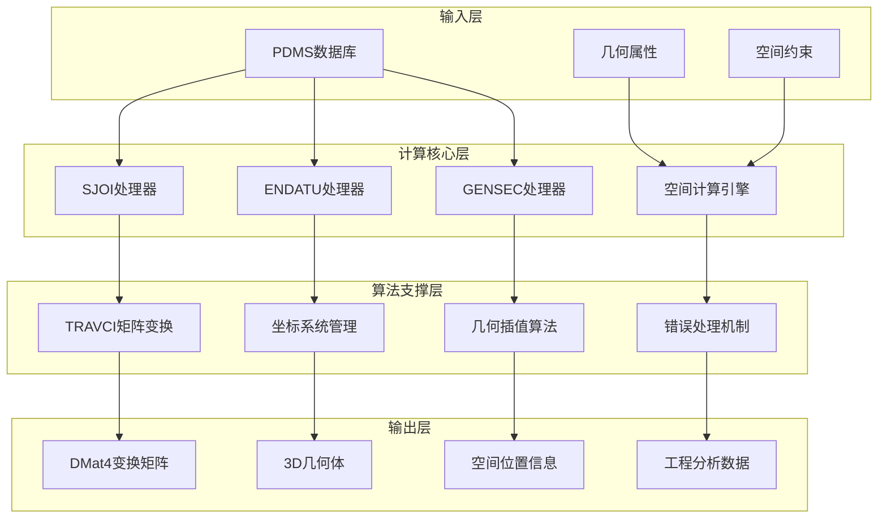

### 核心组件交互关系

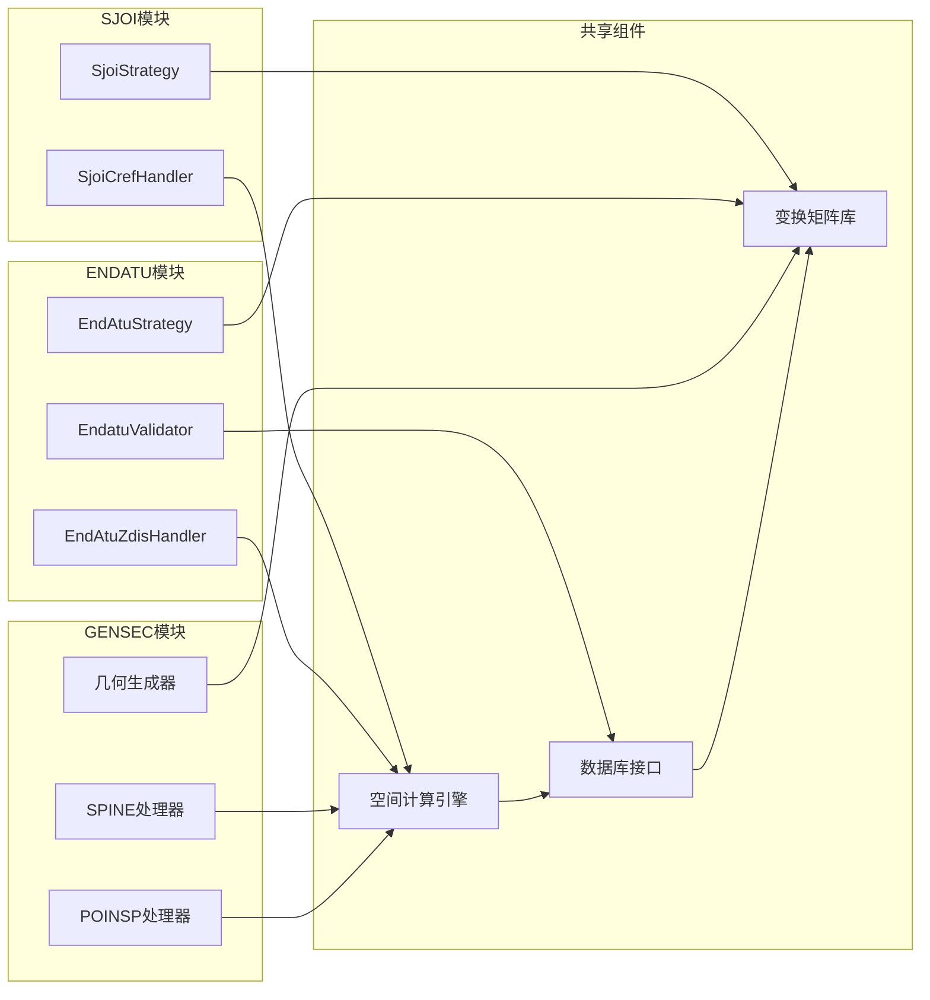

---

## 🔄 数据流向图

### 完整计算数据流

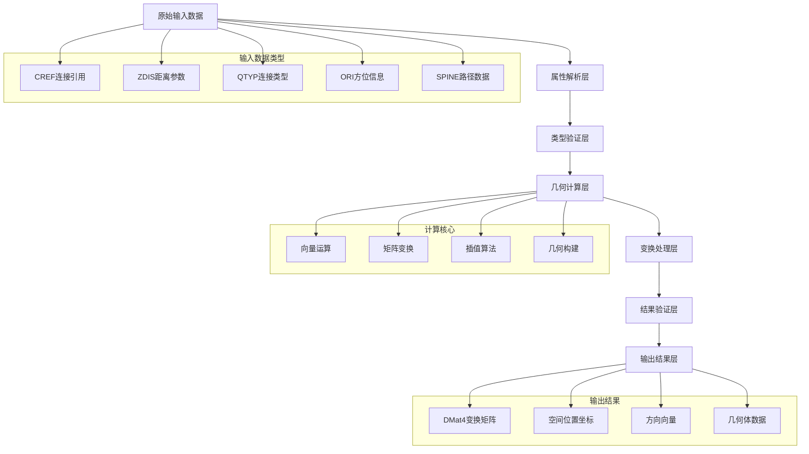

### SJOI计算数据流

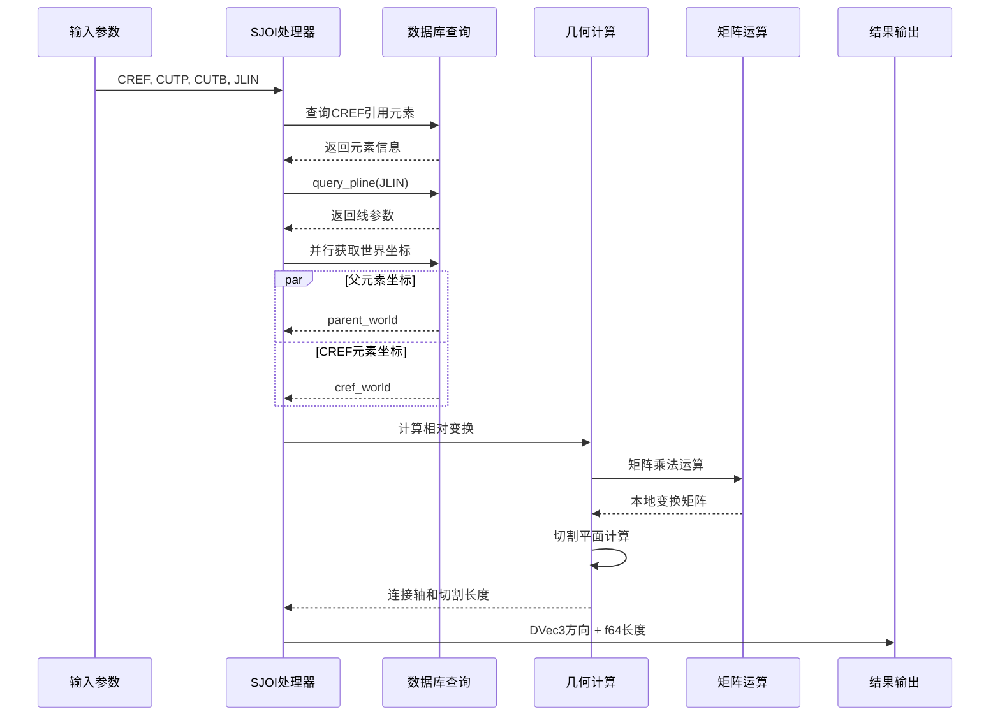

---

## 🎯 算法决策树

### 方位计算策略选择

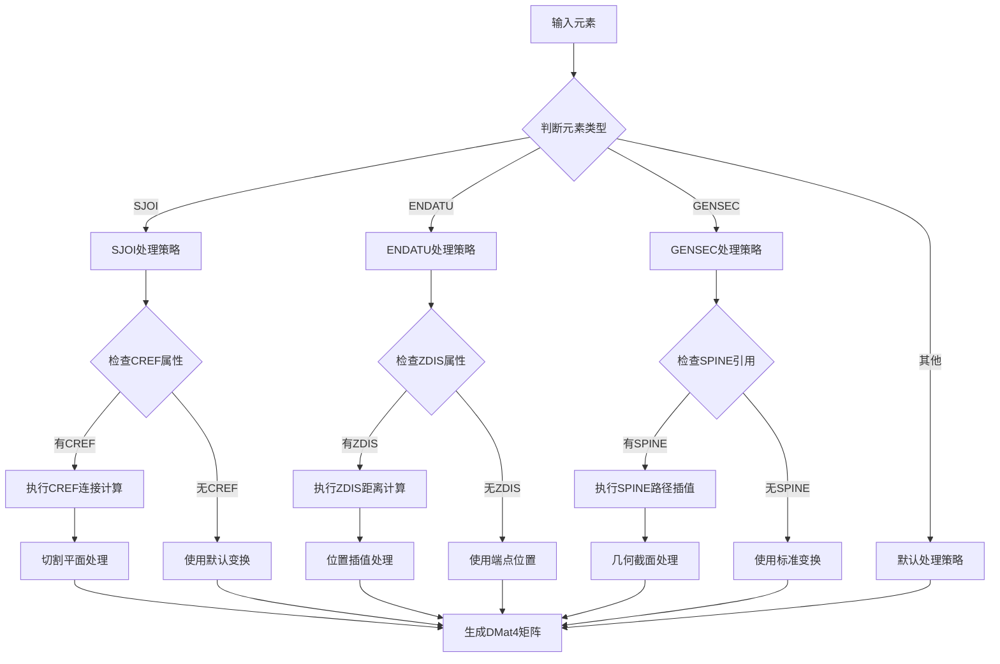

### 错误处理决策流

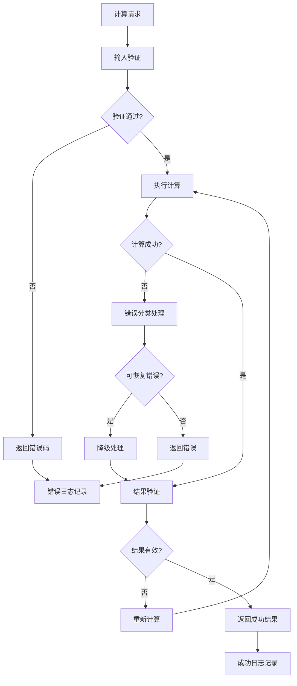

---

## 📊 性能架构图

### 计算性能优化架构

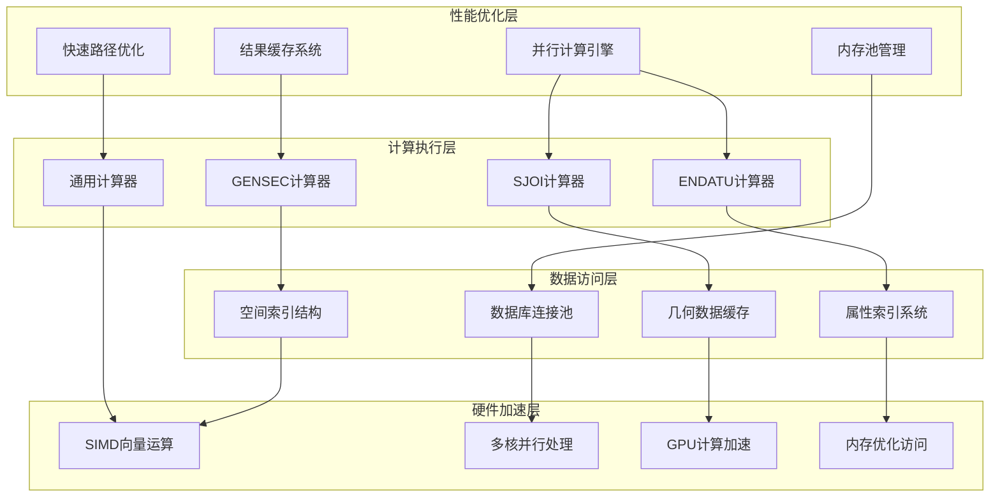

### 缓存策略架构

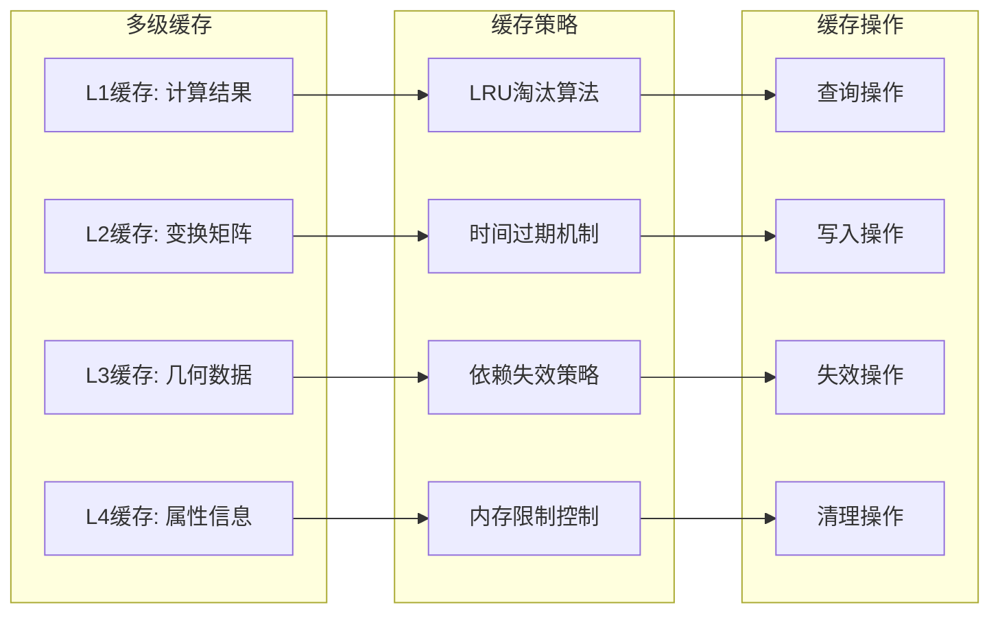

---

## 🔧 模块依赖图

### 代码模块依赖关系

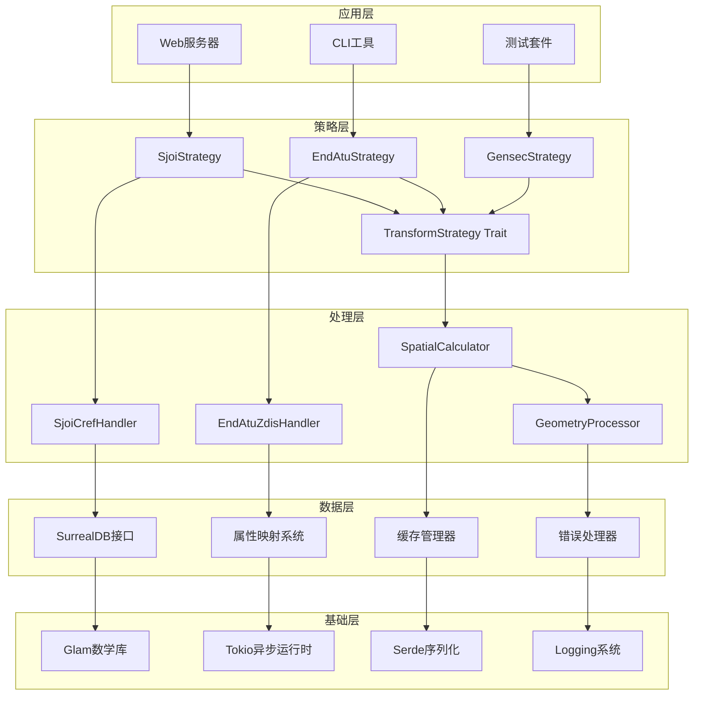

### 编译时依赖图

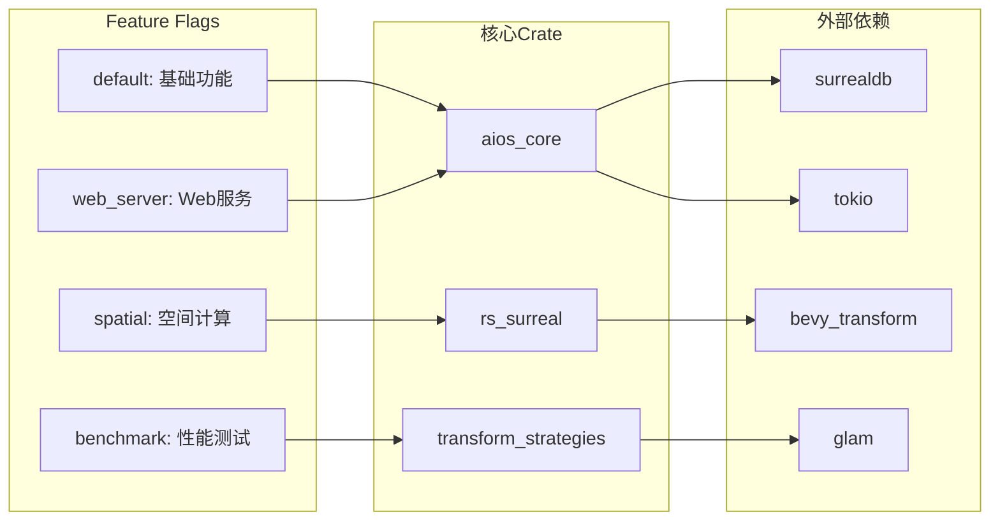

---

## 🧪 测试架构图

### 测试体系架构

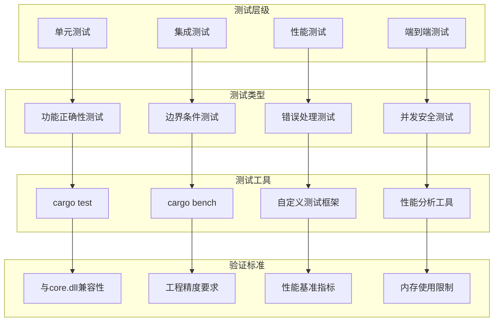

### 持续集成测试流程

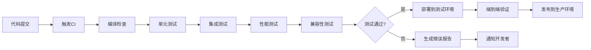

---

## 📈 监控和分析架构

### 性能监控架构

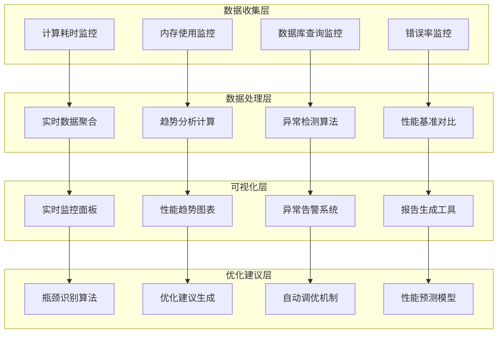

---

## 🎯 总结

### 架构特点

1. **模块化设计**: 清晰的分层架构，便于维护和扩展
2. **高性能优化**: 多级缓存和并行计算确保处理效率
3. **完整测试体系**: 全面的测试覆盖保证代码质量
4. **兼容性保证**: 与core.dll保持算法一致性

### 技术价值

- **工程精度**: 满足工业级精度要求
- **性能优化**: 支持大规模场景处理
- **可维护性**: 清晰的架构便于长期维护
- **扩展性**: 支持新功能的无缝集成

---

**文档版本**: 1.0  
**创建日期**: 2025-11-23  
**架构范围**: SJOI + ENDATU + GENSEC  
**技术栈**: Rust + SurrealDB + Mermaid
